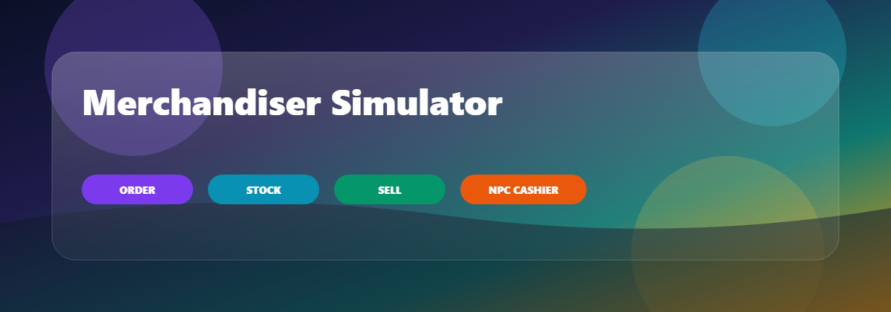
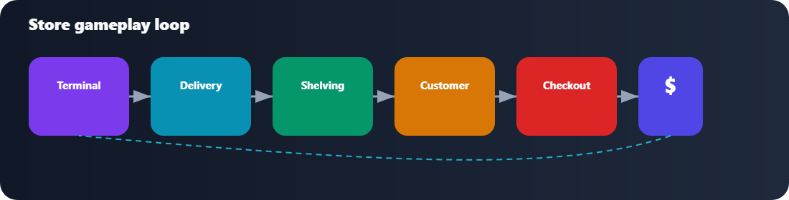
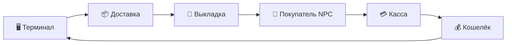
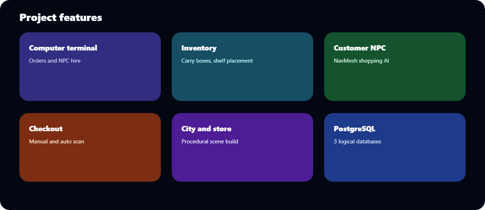
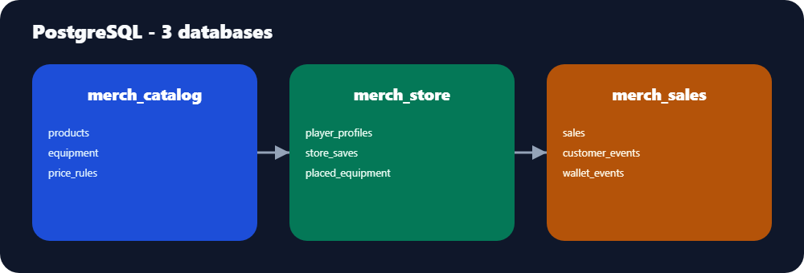

<div align="center">

<!-- HERO -->

<a href="https://github.com/SaShochka/supermarket-sim-unity">
  
</a>

# Симулятор мерчендайзера

### 3D-симулятор супермаркета от первого лица · Unity 6 · NavMesh · PostgreSQL

<br/>

[](https://unity.com/)
[](https://docs.microsoft.com/dotnet/csharp/)
[](https://www.postgresql.org/)
[](https://docs.unity3d.com/Manual/nav-BuildingNavMesh.html)
[](https://github.com/SaShochka/supermarket-sim-unity)

<br/>

[](https://github.com/SaShochka/supermarket-sim-unity/commits/master)
[](https://github.com/SaShochka/supermarket-sim-unity)
[](https://github.com/SaShochka/supermarket-sim-unity)
[](https://github.com/SaShochka/supermarket-sim-unity)

<br/>

**[Скачать игру](#-скачать-игру-windows)** ·
**[БД и SQL](#postgresql--схема-данных)** ·
**[Код C#](#исходный-код-c)** ·
**[Витрина](docs/index.html)** ·
**[docs/CODE.md](docs/CODE.md)** ·
**[docs/DATABASE.md](docs/DATABASE.md)**

<br/>

| | |
|:---:|:---:|
| **Закупка** | терминал → доставка |
| **Выкладка** | полки → ассортимент |
| **Продажа** | касса → доход |
| **Автоматизация** | NPC-кассир |

</div>

---

## PostgreSQL — схема данных

> Три отдельные базы: каталог, состояние магазина, продажи.  
> Полный разбор: [docs/DATABASE.md](docs/DATABASE.md) · SQL-файлы: [Database/postgres/](Database/postgres/)

```powershell
.\Database\postgres\Install-PostgresDatabases.ps1 -User postgres
```

### Обзор баз

| База | Назначение | Ключевые таблицы |
|------|------------|------------------|
| **merch_catalog** | Справочник терминала | `products`, `equipment`, `price_rules` |
| **merch_store** | Сохранение магазина | `player_profiles`, `store_saves`, `shelf_inventory`, `delivery_zone_items` |
| **merch_sales** | Продажи и аналитика | `sale_sessions`, `sales`, `customer_events`, `wallet_events` |

### Таблица `products` (merch_catalog)

| Поле | Тип | Описание |
|------|-----|----------|
| `id` | BIGSERIAL | Первичный ключ |
| `code` | TEXT UNIQUE | Код SKU (`chips`, `bread`, …) |
| `display_name` | TEXT | Название в UI |
| `base_price` | INTEGER | Закупочная цена |
| `sale_price` | INTEGER | Цена на кассе (по умолчанию 15) |
| `prefab_key` | TEXT | Ключ префаба Unity |
| `is_active` | BOOLEAN | Активен в каталоге |

```sql
CREATE TABLE products (
    id           BIGSERIAL PRIMARY KEY,
    code         TEXT NOT NULL UNIQUE,
    display_name TEXT NOT NULL,
    category     TEXT NOT NULL DEFAULT 'food',
    base_price   INTEGER NOT NULL CHECK (base_price >= 0),
    sale_price   INTEGER NOT NULL DEFAULT 15,
    prefab_key   TEXT,
    is_active    BOOLEAN NOT NULL DEFAULT TRUE
);

INSERT INTO products (code, display_name, base_price, sale_price) VALUES
    ('chips', 'Чипсы', 25, 15),
    ('bread', 'Хлеб', 18, 15),
    ('drink', 'Напиток', 22, 15);
```

### Таблица `player_profiles` и `shelf_inventory` (merch_store)

| Таблица | Поле | Тип | Описание |
|---------|------|-----|----------|
| `player_profiles` | `money` | INTEGER | Баланс игрока (старт 300) |
| `store_saves` | `player_position` | JSONB | Позиция `{x,y,z}` |
| `shelf_inventory` | `shelf_code` | TEXT | Идентификатор полки |
| `shelf_inventory` | `product_code` | TEXT | Товар на слоте |
| `shelf_inventory` | `quantity` | INTEGER | Количество |
| `delivery_zone_items` | `product_code` | TEXT | Коробка в зоне доставки |

```sql
CREATE TABLE player_profiles (
    id UUID PRIMARY KEY DEFAULT gen_random_uuid(),
    profile_name TEXT NOT NULL UNIQUE,
    money INTEGER NOT NULL DEFAULT 300 CHECK (money >= 0)
);

CREATE TABLE shelf_inventory (
    save_id UUID NOT NULL,
    shelf_code TEXT NOT NULL,
    placement_index INTEGER NOT NULL,
    product_code TEXT NOT NULL,
    quantity INTEGER NOT NULL DEFAULT 1,
    UNIQUE (save_id, shelf_code, placement_index)
);
```

### Таблица `sales` и события (merch_sales)

| Таблица | Поле | Тип | Описание |
|---------|------|-----|----------|
| `sales` | `unit_price` | INTEGER | Цена за единицу |
| `sales` | `total_price` | INTEGER | Вычисляемое: `unit_price * quantity` |
| `customer_events` | `event_type` | TEXT | `spawned`, `queued`, `paid`, … |
| `wallet_events` | `amount_delta` | INTEGER | Изменение баланса |
| `wallet_events` | `balance_after` | INTEGER | Баланс после операции |

```sql
CREATE TABLE sales (
    id UUID PRIMARY KEY DEFAULT gen_random_uuid(),
    product_code TEXT NOT NULL,
    product_name TEXT NOT NULL,
    unit_price INTEGER NOT NULL DEFAULT 15,
    quantity INTEGER NOT NULL DEFAULT 1,
    total_price INTEGER GENERATED ALWAYS AS (unit_price * quantity) STORED,
    sold_at TIMESTAMPTZ NOT NULL DEFAULT NOW()
);

CREATE TABLE customer_events (
    event_type TEXT NOT NULL CHECK (event_type IN (
        'spawned', 'entered', 'picked_product', 'queued',
        'paid', 'left_no_product', 'left_after_sale'
    )),
    product_code TEXT,
    details JSONB NOT NULL DEFAULT '{}'
);
```

### Пример запроса

```sql
-- Выручка за сегодня (merch_sales)
SELECT product_name, SUM(quantity) AS qty, SUM(total_price) AS revenue
FROM sales WHERE sold_at >= CURRENT_DATE
GROUP BY product_name ORDER BY revenue DESC;
```

---

## Исходный код (C#)

> **27 скриптов** в `Assets/Scripts/`. Полный разбор: [docs/CODE.md](docs/CODE.md)

### Все скрипты проекта

| Модуль | Файл | Назначение |
|--------|------|------------|
| Interaction | `IInteractable.cs` | Контракт «нажми E» |
| Interaction | `PlayerInteractor.cs` | Луч из камеры, подсказки |
| Player | `FpsPlayerController.cs` | Движение FPS |
| Player | `SimpleInputHandler.cs` | WASD, E, Esc |
| Player | `PlayerWallet.cs` | Деньги и UI |
| Player | `PlayerCarry.cs` | Переноска коробок |
| Player | `PlayerCashierMode.cs` | Режим кассира |
| Gameplay | `ComputerTerminalUI.cs` | UI магазина |
| Gameplay | `ComputerTerminalInteractable.cs` | Точка терминала |
| Gameplay | `CustomerNpc.cs` | AI покупателя |
| Gameplay | `CustomerSpawner.cs` | Спавн NPC |
| Gameplay | `CustomerNavMeshRuntime.cs` | NavMesh Surface |
| Gameplay | `CashierStationInteractable.cs` | Касса, NPC-кассир |
| Gameplay | `CheckoutBeltItem.cs` | Товар на ленте |
| Gameplay | `ShelfPlacementPoint.cs` | Слот на полке |
| Gameplay | `PickupableItem.cs` | Подбираемый предмет |
| Gameplay | `ProximityDoor.cs` | Автодвери |
| Gameplay | `EquipmentPlacementController.cs` | Установка оборудования |
| Architecture | `MainMenuUI.cs` | Главное меню |
| Architecture | `GameContext.cs` | Контекст сцены Game |

### Взаимодействие (E)

```csharp
// Assets/Scripts/Interaction/IInteractable.cs
public interface IInteractable
{
    string GetInteractionPrompt();
    void Interact(GameObject interactor);
}
```

```csharp
// Assets/Scripts/Interaction/PlayerInteractor.cs
public bool Interact()
{
    if (currentInteractable != null)
    {
        currentInteractable.Interact(gameObject);
        return true;
    }
    return false;
}
```

### NPC и NavMesh

```csharp
// Assets/Scripts/Gameplay/CustomerNpc.cs
private IEnumerator CustomerRoutine()
{
    yield return MoveTo(entrance);
    yield return MoveTo(browsePoint);
    var item = FindAvailableProduct();
    // подбор → очередь → касса → выход
}
```

```csharp
// Assets/Scripts/Gameplay/CustomerNavMeshRuntime.cs
public void Rebuild()
{
    PlayerOnlyStoreBoundary.ConfigureManualBoundaryObjects();
    surface.BuildNavMesh();
}
```

### Касса и кошелёк

```csharp
// Assets/Scripts/Gameplay/CashierStationInteractable.cs
public void ScanBeltItem(CheckoutBeltItem scannedItem)
{
    currentItemScanned = true;
    payoutWallet.AddMoney(salePrice);
}
```

```csharp
// Assets/Scripts/Player/PlayerWallet.cs
public bool TrySpend(int amount)
{
    if (money < amount) return false;
    money -= amount;
    OnMoneyChanged?.Invoke(money);
    RefreshUI();
    return true;
}
```

### Терминал закупок

```csharp
// Assets/Scripts/Gameplay/ComputerTerminalInteractable.cs
public void Interact(GameObject interactor)
{
    var player = interactor.GetComponent<FpsPlayerController>();
    terminalUI.OpenUI(player);
}
```

---

## Витрина

> Полноэкранная презентация с анимацией и иллюстрациями — в каталоге [`docs/`](docs/).

<table>
<tr>
<td width="50%">

**Локально:** откройте [`docs/index.html`](docs/index.html) в браузере.

</td>
<td width="50%">

**Онлайн:** [витрина на GitHub Pages](https://sashochka.github.io/supermarket-sim-unity/) (папка `docs/`).

</td>
</tr>
</table>

---

## Игровой цикл

<p align="center">
  
</p>



---

## Возможности

<p align="center">
  
</p>

<details open>
<summary><strong>Развернуть список механик</strong></summary>

<br/>

| Механика | Описание |
|----------|----------|
| **Компьютерный терминал** | Заказ продуктов и оборудования, найм NPC-кассира |
| **Зона доставки** | Поставки после покупки в терминале |
| **Выкладка** | Переноска коробок, размещение на `ShelfPlacementPoint` |
| **Покупатели** | `CustomerNpc` + NavMesh: вход → полка → касса |
| **Касса** | Ручной режим игрока или автосканирование NPC |
| **Экономика** | `PlayerWallet`, фиксация продаж |
| **Окружение** | Процедурный магазин, город, двери `ProximityDoor` |
| **Звук** | `GameAudio` — музыка и SFX |
| **БД** | 3 PostgreSQL-базы для демонстрации ИС |

</details>

---

## Архитектура кода (кратко)

<table>
<tr>
<td align="center" width="20%"></td>
<td><code>FpsPlayerController</code> · <code>PlayerInteractor</code> · <code>PlayerCarry</code> · <code>PlayerCashierMode</code> · <code>PlayerWallet</code></td>
</tr>
<tr>
<td align="center"></td>
<td><code>ComputerTerminalUI</code> · <code>ComputerTerminalInteractable</code></td>
</tr>
<tr>
<td align="center"></td>
<td><code>CustomerNpc</code> · <code>CustomerSpawner</code> · <code>CustomerNavMeshRuntime</code></td>
</tr>
<tr>
<td align="center"></td>
<td><code>CashierStationInteractable</code> · <code>CheckoutBeltItem</code></td>
</tr>
<tr>
<td align="center"></td>
<td><code>GameContext</code> · <code>MenuContext</code> · <code>MainMenuUI</code></td>
</tr>
</table>

<p align="center">
  
</p>

---

## Скачать игру (Windows)

Готовая сборка без Unity — распакуйте архив и запустите `SupermarketSim.exe`.

<p align="center">
  <a href="releases/SupermarketSim-Windows.zip">
    
  </a>
</p>

| | |
|---|---|
| **Файл** | [`releases/SupermarketSim-Windows.zip`](releases/SupermarketSim-Windows.zip) |
| **Платформа** | Windows x64 |
| **Запуск** | Распаковать → `SupermarketSim.exe` |
| **Управление** | WASD, мышь, `E` — взаимодействие, `Esc` — выход из режима |

> PostgreSQL для игры не обязателен — базы нужны только для демонстрации схемы данных.

---

## Быстрый старт (из исходников)

### Требования

- **Unity 6000.4.4f1** (Unity 6)
- **Windows** — целевая сборка
- **PostgreSQL 15+** — опционально, для схемы БД

### Запуск

```bash
git clone https://github.com/SaShochka/supermarket-sim-unity.git
cd supermarket-sim-unity
```

1. Unity Hub → **Open** → папка проекта  
2. Сцены: `Assets/Scenes/Menu.unity` → `Assets/Scenes/Game.unity`  
3. **Play**

### Управление

| Клавиша | Действие |
|:-------:|----------|
| `W A S D` | Движение |
| **Мышь** | Обзор |
| `E` | Взаимодействие (терминал, полка, касса, предметы) |
| `Esc` | Выход из режима / закрыть UI |

---

## Структура репозитория

```text
supermarket-sim-unity/
├── Assets/
│   ├── Scenes/           # Menu.unity, Game.unity
│   └── Scripts/          # Player, Gameplay, Interaction, Architecture
├── Database/postgres/    # SQL + Install-PostgresDatabases.ps1
├── docs/
│   ├── index.html        # Витрина (GitHub Pages)
│   ├── CODE.md           # Документация по C#-скриптам
│   ├── DATABASE.md       # Документация по PostgreSQL
│   └── assets/           # Иллюстрации для README
├── releases/
│   └── SupermarketSim-Windows.zip
├── Concept.md
├── Plan.md
└── tools/
```

---

## Документация

| Файл | Назначение |
|------|------------|
| [Concept.md](Concept.md) | Концепт игры |
| [Plan.md](Plan.md) | План и статус задач |
| [docs/CODE.md](docs/CODE.md) | **Исходный код:** 27 скриптов, сниппеты, диаграммы |
| [docs/DATABASE.md](docs/DATABASE.md) | **PostgreSQL:** ER, таблицы, SQL, примеры запросов |
| [docs/README.md](docs/README.md) | Оглавление материалов |
| [Database/postgres/](Database/postgres/) | SQL-скрипты и установка |

---

## Стек

<p align="center">
  
  
  
  
  
  
  
</p>

---

<div align="center">

### Готов к демонстрации

**Закупка → выкладка → продажа → рост магазина**

<br/>

[](https://sashochka.github.io/supermarket-sim-unity/)
[](https://github.com/SaShochka/supermarket-sim-unity/issues)
[](https://github.com/SaShochka/supermarket-sim-unity/stargazers)

</div>
