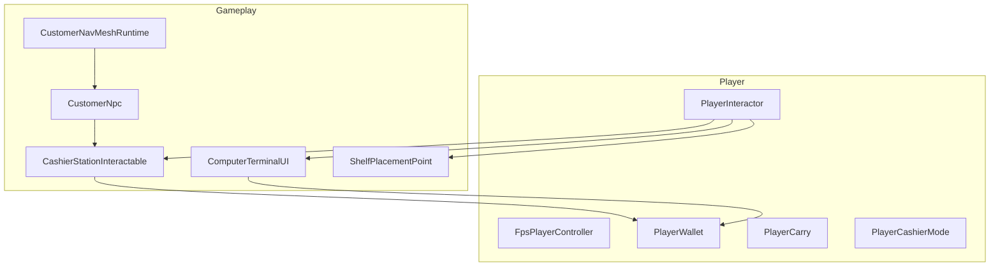

# Исходный код — обзор модулей

В проекте **27 игровых скриптов** в `Assets/Scripts/`. Ниже — карта модулей, ключевые фрагменты и связи между системами.

---

## Структура каталогов

```text
Assets/Scripts/
├── Architecture/     # Контексты сцен, главное меню
├── Gameplay/         # Терминал, NPC, касса, полки, звук, город
├── Interaction/      # IInteractable, луч взаимодействия
└── Player/           # FPS, кошелёк, переноска, режим кассира
```



---

## Interaction — единый контракт

Все объекты «нажми E» реализуют один интерфейс:

```csharp
// Assets/Scripts/Interaction/IInteractable.cs
public interface IInteractable
{
    string GetInteractionPrompt();
    void Interact(GameObject interactor);
}
```

`PlayerInteractor` ищет объект лучом из камеры и вызывает `Interact()` по клавише **E**:

```csharp
// Assets/Scripts/Interaction/PlayerInteractor.cs
public bool Interact()
{
    if (currentInteractable != null)
    {
        currentInteractable.Interact(this.gameObject);
        return true;
    }
    return false;
}
```

---

## Player — управление и экономика

| Скрипт | Роль |
|--------|------|
| `FpsPlayerController` | Движение от первого лица, камера |
| `SimpleInputHandler` | WASD, E, Esc — маршрутизация ввода |
| `PlayerInteractor` | Подсказки и взаимодействие |
| `PlayerCarry` | Переноска коробок |
| `PlayerCashierMode` | Посадка за кассу, отдельная камера |
| `PlayerWallet` | Баланс, UI, события `OnMoneyChanged` |

Кошелёк — центр экономики:

```csharp
// Assets/Scripts/Player/PlayerWallet.cs
public class PlayerWallet : MonoBehaviour
{
    [SerializeField] private int money = 300;
    public int Money => money;
    public event System.Action<int> OnMoneyChanged;

    public bool TrySpend(int amount)
    {
        if (amount < 0 || money < amount) return false;
        money -= amount;
        OnMoneyChanged?.Invoke(money);
        RefreshUI();
        return true;
    }

    public void AddMoney(int amount)
    {
        if (amount <= 0) return;
        money += amount;
        OnMoneyChanged?.Invoke(money);
        RefreshUI();
    }
}
```

---

## Gameplay — терминал и закупки

`ComputerTerminalUI` — магазин внутри магазина: вкладки **Продукты** / **Оборудование**, списание с `PlayerWallet`, спавн в `deliveryZone`.

```csharp
// Assets/Scripts/Gameplay/ComputerTerminalInteractable.cs
public void Interact(GameObject interactor)
{
    var playerController = interactor.GetComponent<FpsPlayerController>();
    terminalUI.OpenUI(playerController);
}
```

Каталог задаётся сериализуемыми списками `FoodCatalogItem` и `EquipmentCatalogItem` — те же коды, что в `merch_catalog.products.code`.

---

## Gameplay — выкладка

`ShelfPlacementPoint` принимает предмет из рук игрока:

```csharp
// Assets/Scripts/Gameplay/ShelfPlacementPoint.cs
public void Interact(GameObject interactor)
{
    var carrier = interactor.GetComponent<PlayerCarry>();
    if (carrier != null && carrier.IsCarrying)
    {
        var item = carrier.GetCarriedItem();
        carrier.RemoveItem();
        item.PlaceOnShelf(this);
        currentItem = item;
    }
}
```

`PickupableItem` — подбор с пола / снятие с полки. `EquipmentPlacementController` — установка купленных полок и касс.

---

## Gameplay — NPC и NavMesh

`CustomerNavMeshRuntime` собирает NavMesh в рантайме:

```csharp
// Assets/Scripts/Gameplay/CustomerNavMeshRuntime.cs
public void Rebuild()
{
    PlayerOnlyStoreBoundary.ConfigureManualBoundaryObjects();
    surface.BuildNavMesh();
}

public static Vector3 NearestNavMeshPoint(Vector3 point, float radius = 8f)
{
    if (NavMesh.SamplePosition(point, out var hit, radius, NavMesh.AllAreas))
        return hit.position;
    return point;
}
```

Цикл покупателя:

```csharp
// Assets/Scripts/Gameplay/CustomerNpc.cs
private IEnumerator CustomerRoutine()
{
    var entrance = new Vector3(0f, 0f, -18f);
    var browsePoint = new Vector3(Random.Range(-8f, 8f), 0f, Random.Range(8f, 18f));

    yield return MoveTo(entrance);
    yield return MoveTo(browsePoint);

    var item = FindAvailableProduct();
    // ... подбор → очередь на кассу → оплата → выход
}
```

`CustomerSpawner` создаёт NPC с интервалом. `CustomerSystemBootstrap` связывает спавнер с NavMesh.

---

## Gameplay — касса

Игрок или нанятый NPC-кассир сканирует товар на ленте:

```csharp
// Assets/Scripts/Gameplay/CashierStationInteractable.cs
public void ScanBeltItem(CheckoutBeltItem scannedItem)
{
    currentItemScanned = true;
    var payoutWallet = currentPlayer != null
        ? currentPlayer.GetComponent<PlayerWallet>()
        : hiredCashierWallet;
    if (payoutWallet != null)
        payoutWallet.AddMoney(salePrice);
    // завершение обслуживания покупателя...
}
```

Режим кассира включается через `Interact()` → `PlayerCashierMode.EnterStation()`.

Автосканирование NPC:

```csharp
private void Update()
{
    if (!hasHiredCashier || beltItem == null || currentItemScanned) return;
    autoScanTimer -= Time.deltaTime;
    if (autoScanTimer <= 0f)
        ScanBeltItem(beltItem);
}
```

---

## Gameplay — окружение

| Скрипт | Описание |
|--------|----------|
| `ProximityDoor` | Раздвижные двери при приближении игрока |
| `CityBackdropRuntime` | Силуэт города / небоскрёбы (декор) |
| `PlayerOnlyStoreBoundary` | Невидимые барьеры улицы |
| `GameAudio` | Музыка и звуковые эффекты |
| `StoreEquipmentSpawner` | Спавн оборудования из терминала |

Двери:

```csharp
// Assets/Scripts/Gameplay/ProximityDoor.cs
private void Update()
{
    if (player == null) return;
    float dist = Vector3.Distance(player.position, transform.position);
    bool open = dist <= openDistance;
    // плавное смещение leftDoor / rightDoor к openPos
}
```

---

## Architecture — сцены

| Скрипт | Сцена |
|--------|-------|
| `ApplicationContext` | Базовый контекст приложения |
| `GameContext` | Инициализация `Game.unity` |
| `MenuContext` | Инициализация `Menu.unity` |
| `MainMenuUI` | Кнопка «Играть», фон, курсор |

Сборка Windows: `Assets/Editor/SupermarketSim_BuildPipeline.cs` → сцены `Menu.unity`, `Game.unity`.

---

## Полный список скриптов (27)

| # | Файл | Кратко |
|---|------|--------|
| 1 | `Architecture/ApplicationContext.cs` | Базовый контекст |
| 2 | `Architecture/GameContext.cs` | Контекст игровой сцены |
| 3 | `Architecture/MenuContext.cs` | Контекст меню |
| 4 | `Architecture/MainMenuUI.cs` | UI главного меню |
| 5 | `Gameplay/CashierStationInteractable.cs` | Касса, NPC-кассир |
| 6 | `Gameplay/CheckoutBeltItem.cs` | Товар на ленте |
| 7 | `Gameplay/CityBackdropRuntime.cs` | Городской фон |
| 8 | `Gameplay/ComputerTerminalInteractable.cs` | Точка терминала |
| 9 | `Gameplay/ComputerTerminalUI.cs` | UI магазина |
| 10 | `Gameplay/CustomerNavMeshRuntime.cs` | NavMesh Surface |
| 11 | `Gameplay/CustomerNpc.cs` | Покупатель AI |
| 12 | `Gameplay/CustomerSpawner.cs` | Спавн NPC |
| 13 | `Gameplay/CustomerSystemBootstrap.cs` | Старт NPC-системы |
| 14 | `Gameplay/EquipmentPlacementController.cs` | Установка оборудования |
| 15 | `Gameplay/GameAudio.cs` | Аудио |
| 16 | `Gameplay/PickupableItem.cs` | Подбираемый товар |
| 17 | `Gameplay/PlayerOnlyStoreBoundary.cs` | Границы магазина |
| 18 | `Gameplay/ProximityDoor.cs` | Автодвери |
| 19 | `Gameplay/ShelfPlacementPoint.cs` | Слот на полке |
| 20 | `Gameplay/StoreEquipmentSpawner.cs` | Спавн полок/касс |
| 21 | `Interaction/IInteractable.cs` | Интерфейс взаимодействия |
| 22 | `Interaction/PlayerInteractor.cs` | Луч + E |
| 23 | `Player/FpsPlayerController.cs` | FPS-контроллер |
| 24 | `Player/PlayerCarry.cs` | Переноска |
| 25 | `Player/PlayerCashierMode.cs` | Режим кассира |
| 26 | `Player/PlayerWallet.cs` | Деньги |
| 27 | `Player/SimpleInputHandler.cs` | Ввод |

---

## Сборка и инструменты

```powershell
# Windows-архив для GitHub
.\tools\Build-WindowsRelease.ps1
```

Editor: `SupermarketSim_BuildPipeline.BuildWindows` — batchmode из CI или командной строки Unity.
