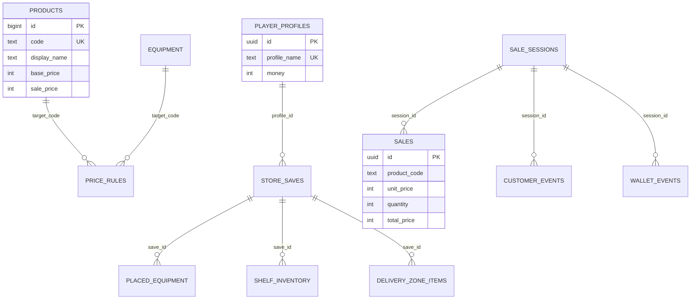

# PostgreSQL — схема данных

Проект использует **три отдельные базы**, чтобы каталог, состояние магазина и продажи не смешивались в одной схеме.

| База | Файл | Назначение |
|------|------|------------|
| `merch_catalog` | [01_merch_catalog.sql](../Database/postgres/01_merch_catalog.sql) | Справочник товаров, оборудования и правил цен |
| `merch_store` | [02_merch_store.sql](../Database/postgres/02_merch_store.sql) | Профиль игрока, сохранения, полки, доставка |
| `merch_sales` | [03_merch_sales.sql](../Database/postgres/03_merch_sales.sql) | Сессии продаж, события NPC, движение денег |

Установка одной командой:

```powershell
.\Database\postgres\Install-PostgresDatabases.ps1 -User postgres
```

---

## ER-диаграмма (логическая)



---

## 1. `merch_catalog` — каталог магазина

### Таблица `products`

Хранит SKU, отображаемое имя, закупочную и розничную цену, ключ префаба для Unity.

```sql
CREATE TABLE IF NOT EXISTS products (
    id              BIGSERIAL PRIMARY KEY,
    code            TEXT NOT NULL UNIQUE,
    display_name    TEXT NOT NULL,
    category        TEXT NOT NULL DEFAULT 'food',
    base_price      INTEGER NOT NULL CHECK (base_price >= 0),
    sale_price      INTEGER NOT NULL DEFAULT 15 CHECK (sale_price >= 0),
    prefab_key      TEXT,
    icon_key        TEXT,
    is_active       BOOLEAN NOT NULL DEFAULT TRUE
);
```

Стартовые товары (фрагмент):

```sql
INSERT INTO products (code, display_name, category, base_price, sale_price, prefab_key)
VALUES
    ('chips', 'Чипсы', 'food', 25, 15, 'chips'),
    ('bread', 'Хлеб', 'food', 18, 15, 'bread'),
    ('drink', 'Напиток', 'drink', 22, 15, 'drink');
```

### Таблица `equipment`

Полки, кассы и декор для терминала закупок.

```sql
CREATE TABLE IF NOT EXISTS equipment (
    code            TEXT NOT NULL UNIQUE,
    display_name    TEXT NOT NULL,
    equipment_type  TEXT NOT NULL CHECK (equipment_type IN ('shelf', 'cash_register', 'decor', 'other')),
    price           INTEGER NOT NULL CHECK (price >= 0),
    is_placeable    BOOLEAN NOT NULL DEFAULT TRUE
);
```

### Таблица `price_rules`

Гибкие правила наценки: множитель, фиксированная надбавка, период действия.

```sql
CREATE TABLE IF NOT EXISTS price_rules (
    target_type     TEXT NOT NULL CHECK (target_type IN ('product', 'equipment', 'global')),
    target_code     TEXT,
    multiplier      NUMERIC(8, 3) NOT NULL DEFAULT 1.0,
    flat_delta      INTEGER NOT NULL DEFAULT 0,
    starts_at       TIMESTAMPTZ,
    ends_at         TIMESTAMPTZ
);
```

---

## 2. `merch_store` — состояние супермаркета

### Профиль и деньги

```sql
CREATE TABLE IF NOT EXISTS player_profiles (
    id              UUID PRIMARY KEY DEFAULT gen_random_uuid(),
    profile_name    TEXT NOT NULL UNIQUE,
    money           INTEGER NOT NULL DEFAULT 300 CHECK (money >= 0)
);
```

### Сохранение сцены

Позиция игрока хранится в `JSONB` — удобно для Unity `Vector3` / `Quaternion`.

```sql
CREATE TABLE IF NOT EXISTS store_saves (
    profile_id      UUID NOT NULL REFERENCES player_profiles(id) ON DELETE CASCADE,
    scene_name      TEXT NOT NULL DEFAULT 'Game',
    player_position JSONB NOT NULL DEFAULT '{"x":0,"y":0,"z":0}',
    player_rotation JSONB NOT NULL DEFAULT '{"x":0,"y":0,"z":0}',
    saved_at        TIMESTAMPTZ NOT NULL DEFAULT NOW()
);
```

### Выкладка на полках

```sql
CREATE TABLE IF NOT EXISTS shelf_inventory (
    save_id         UUID NOT NULL REFERENCES store_saves(id) ON DELETE CASCADE,
    shelf_code      TEXT NOT NULL,
    placement_index INTEGER NOT NULL CHECK (placement_index >= 0),
    product_code    TEXT NOT NULL,
    quantity        INTEGER NOT NULL DEFAULT 1,
    UNIQUE (save_id, shelf_code, placement_index)
);
```

### Зона доставки

Коробки после покупки в терминале:

```sql
CREATE TABLE IF NOT EXISTS delivery_zone_items (
    save_id         UUID NOT NULL REFERENCES store_saves(id) ON DELETE CASCADE,
    product_code    TEXT NOT NULL,
    quantity        INTEGER NOT NULL DEFAULT 1
);
```

---

## 3. `merch_sales` — аналитика и экономика

### Сессия смены

```sql
CREATE TABLE IF NOT EXISTS sale_sessions (
    profile_name    TEXT NOT NULL DEFAULT 'Default',
    started_at      TIMESTAMPTZ NOT NULL DEFAULT NOW(),
    ended_at        TIMESTAMPTZ,
    starting_money  INTEGER NOT NULL DEFAULT 300,
    ending_money    INTEGER
);
```

### Продажа на кассе

`total_price` вычисляется автоматически:

```sql
CREATE TABLE IF NOT EXISTS sales (
    session_id      UUID REFERENCES sale_sessions(id),
    product_code    TEXT NOT NULL,
    product_name    TEXT NOT NULL,
    unit_price      INTEGER NOT NULL DEFAULT 15,
    quantity        INTEGER NOT NULL DEFAULT 1,
    total_price     INTEGER GENERATED ALWAYS AS (unit_price * quantity) STORED,
    sold_at         TIMESTAMPTZ NOT NULL DEFAULT NOW()
);
```

### События покупателей (NPC)

```sql
CREATE TABLE IF NOT EXISTS customer_events (
    event_type TEXT NOT NULL CHECK (event_type IN (
        'spawned', 'entered', 'picked_product', 'queued',
        'paid', 'left_no_product', 'left_after_sale'
    )),
    product_code TEXT,
    details      JSONB NOT NULL DEFAULT '{}'
);
```

### Движение кошелька

```sql
CREATE TABLE IF NOT EXISTS wallet_events (
    event_type    TEXT NOT NULL CHECK (event_type IN (
        'initial', 'buy_product', 'buy_equipment', 'scan_sale', 'refund', 'debug'
    )),
    amount_delta  INTEGER NOT NULL,
    balance_after INTEGER NOT NULL CHECK (balance_after >= 0)
);
```

### Представление для отчётов

```sql
CREATE OR REPLACE VIEW daily_sales_summary AS
SELECT
    DATE_TRUNC('day', sold_at) AS day,
    product_code,
    SUM(quantity) AS units_sold,
    SUM(total_price) AS revenue
FROM sales
GROUP BY DATE_TRUNC('day', sold_at), product_code, product_name;
```

---

## Примеры SQL-запросов

**Топ товаров за сегодня:**

```sql
\c merch_sales
SELECT product_name, SUM(quantity) AS qty, SUM(total_price) AS revenue
FROM sales
WHERE sold_at >= CURRENT_DATE
GROUP BY product_name
ORDER BY revenue DESC;
```

**Остатки на полках в текущем сохранении:**

```sql
\c merch_store
SELECT shelf_code, product_code, quantity
FROM shelf_inventory
ORDER BY shelf_code, placement_index;
```

**Активный каталог:**

```sql
\c merch_catalog
SELECT code, display_name, base_price, sale_price
FROM products
WHERE is_active = TRUE
ORDER BY category, display_name;
```

---

## Связь с Unity

| Игровой объект | Таблица / поле |
|----------------|----------------|
| `ComputerTerminalUI` | `products`, `equipment` |
| `PlayerWallet` | `player_profiles.money`, `wallet_events` |
| `ShelfPlacementPoint` | `shelf_inventory` |
| `CashierStationInteractable` | `sales`, `customer_events` |
| `CustomerNpc` | `customer_events` (spawn → pay) |

> Прямое подключение из билда не используется: схема готова для backend-сервиса или демонстрации на защите ВКР.
